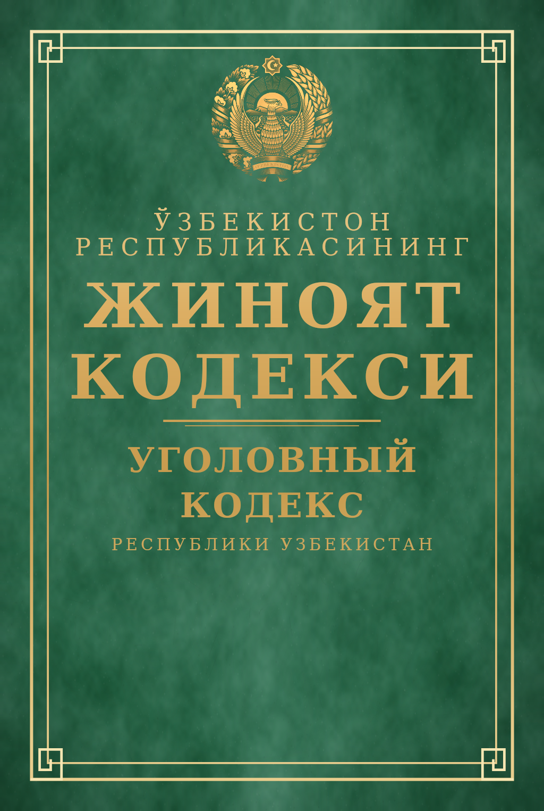

# 📖 ЖИНОЯТ КОДЕКСИ — Realistik 3D kitob

Haqiqiy "Жиноят кодаسی" (Ўзбекистон Республикаси) muqovasidagi kitobning
**real vaqtda ishlaydigan 3D veb-sahifasi**: qattiq charm muqova, oltin jilo
rama, О'zbekiston gerbi, bukiladigan varaqlar — hammasi WebGL (three.js)
yordamida brauzerda chiziladi.



## Imkoniyatlar

- ⚡ **Avtonom kinematik animatsiya** — kitob ochiladi, 5 ta varaq birin-ketin
  aylanadi, so'ng yana yopilib saxna qayta boshlanadi (kamera xoreografiyasi
  bilan birga).
- ✋ **Interaktiv boshqaruv** — muqovani ochish/yopish, sahifa varaqlash
  (◀ ▶ tugmalar, `← →` klaviatura), sichqoncha yoki sensor bilan orqacha,
  burish va dumbalash.
- 🖼 **O'z muqovangiz** — istalgan rasmni yuklab, bevosita kitobga qo'ying
  (avtomatik "cover-fit" kesish). Shuningdek `assets/cover.png|jpg` fayl
  qo'ysangiz sahifa ochilganda usha ishlatiladi.
- 🪄 **Realistik materiallar** — PBR (MeshPhysicalMaterial): metall oltin
  jilo (metalness/roughness), emboss relief (normal map), charm donasi,
  qog'oz tola, varaq chetlari chiziqlari, PMREM atmosfera, soyalar +
  UnrealBloom oltin "yaltirashi".
- ⚙️ **Sifat avtonozatorligi** — sekin qurilmalarda piksel nisbati va bloom
  avtomatic pasayadi; build jarayoni yo'q — sof statik sahifa.

## Ishga tushirish

Har qanday statik server yetarli:

```bash
# python
python3 -m http.server 8080

# yoki node
npx serve .
```

So'ng `http://localhost:8080` ni oching.

## Fayl tuzilishi

```
index.html            — sahifa (import map eski CDN'larsiz, lokal vendor)
styles.css            — HUD, boshqaruv paneli, yuklanish ekrani
src/main.js           — sahna, yorug'lik, kamera xoreografiyasi, taymlayn
src/book.js           — 3D kitob: muqova, umurtqa, varaqlar, bukilish
src/textures.js       — protsedura teksturalar (canvas → PBR xaritalar)
assets/gerb.png       — oltin belgi uslubidagi O'zbekiston gerbi (RGBa)
vendor/three/         — three.js r186 (lokal, ruxsatnoma bilan)
preview/              — Node'da chizilgan tekstura rasmlari (hujjat uchun)
test/render.mjs       — tekstura renderi + geometriya tekshiruvlari
```

## Test (Node, brauzersiz)

`test/render.mjs` `@napi-rs/canvas` yordamida muqova/sahifa/umurtqa
teksturalarini `preview/` ga chizadi va kitob geometriyasini tekshiradi
(bounding box, yoy uzunligi, NaN, UV). Ishga tushirish:

```bash
# npm i @napi-rs/canvas  (biror joyga)
# node_modules/three -> vendor/three ga simlink kerak bo'ladi
node test/render.mjs
```

## Muqovani almashtirish

1. Brauzerda: panel → **🖼 Rasm yuklash** — rasm bir zumda muqovaga o'tadi.
2. Doimiy: `assets/cover.png` (yoki `.jpg/.jpeg/.webp`) fayl qo'ying —
   sahifa ochilganda avtomatik tanlanadi. Rasmning veksel ayroni
   15 : 22.5 ga yaqin bo'lsa ideal.
